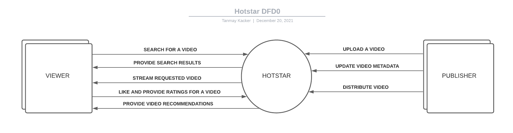
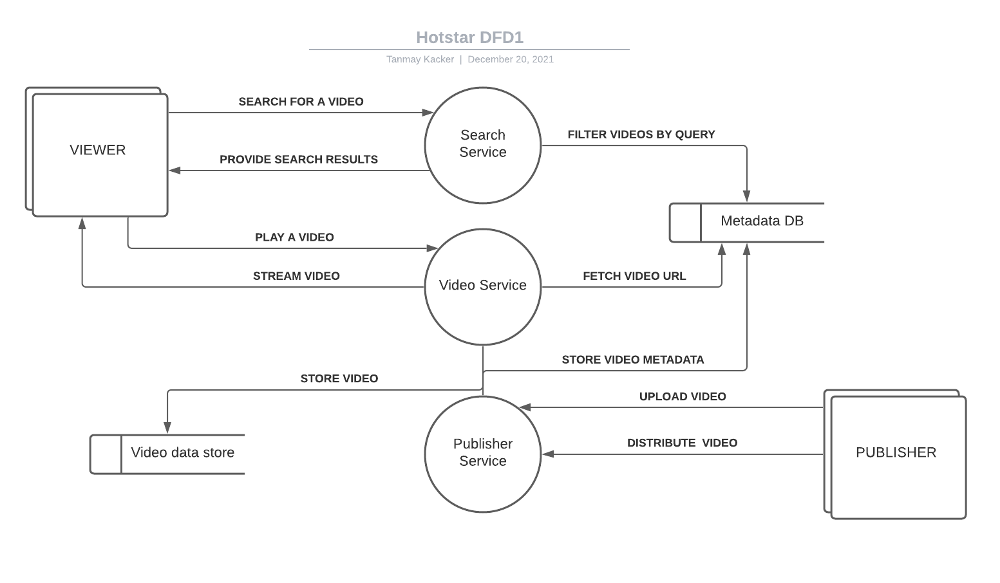
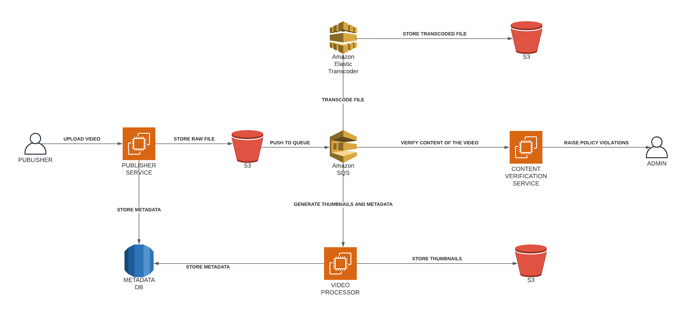
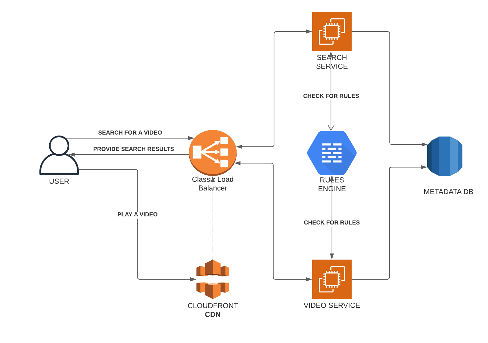
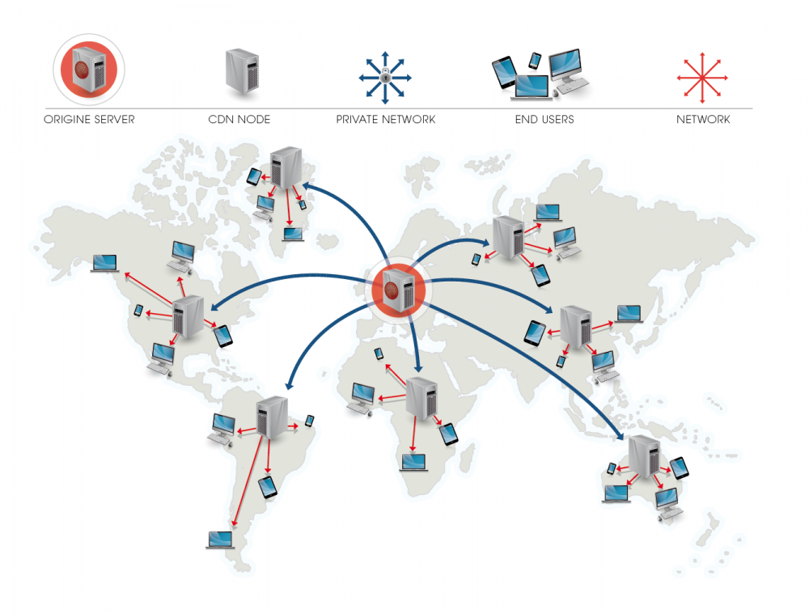

# System design of an OTT

- [System design of an OTT](#system-design-of-an-ott)
  - [How to approach design problems?](#how-to-approach-design-problems)
  - [What is an OTT?](#what-is-an-ott)
  - [What are the requirements of an OTT?](#what-are-the-requirements-of-an-ott)
    - [User requirements](#user-requirements)
    - [Content provider requirements](#content-provider-requirements)
    - [How to get clarity on the requirements?](#how-to-get-clarity-on-the-requirements)
  - [Data ingestion](#data-ingestion)
    - [Back of the envelope calculations](#back-of-the-envelope-calculations)
    - [Data flow diagram](#data-flow-diagram)
    - [Basic data ingestion architecture](#basic-data-ingestion-architecture)
    - [Basic + presigned URL](#basic--presigned-url)
      - [How to handle failures?](#how-to-handle-failures)
      - [Which database to use for metadata?](#which-database-to-use-for-metadata)
    - [Media processing pipeline](#media-processing-pipeline)
    - [Asynchronous processing](#asynchronous-processing)
  - [Streaming content to the users](#streaming-content-to-the-users)
    - [Chunking the content](#chunking-the-content)
    - [Streaming content to the users](#streaming-content-to-the-users-1)
    - [How to handle many concurrent users?](#how-to-handle-many-concurrent-users)
  - [Recap](#recap)
    - [Data ingestion](#data-ingestion-1)
    - [Content streaming](#content-streaming)
  - [Further reading](#further-reading)
## How to approach design problems?

System design is a very broad topic. There are many ways to approach a design problem and there is no one right answer. It is important to understand the requirements and constraints of the problem. It is also important to understand the trade-offs between different approaches. Thus, a systematic approach is required to solve a design problem.
The following is a general approach to solve a design problem:

1. `Gather requirements` - Understand the problem and the requirements.
2. `Clarity` - Ask questions to clarify the requirements.
3. `Scope the problem` - Identify and separate the important requirements from the minor ones. Identify non-functional requirements and do some back of the envelope calculations to get an idea of the scale of the problem.
4. `Design` - Create a technical design document that describes the architecture and the components of the system.

## What is an OTT?

> An over-the-top media service is a media service offered directly to viewers via the Internet. OTT bypasses cable, broadcast, and satellite television platforms; the types of companies that traditionally act as controllers or distributors of such content.

OTT has become an invaluable part of our lives. It has changed the way we consume media. OTT services have become a part of our daily lives. OTT services are used to stream movies, TV shows, music, and other media. OTT services are also used to stream live events.

OTT services are used to stream content on a variety of devices such as mobile phones, tablets, laptops, and smart TVs. OTT services are also used to stream content on a variety of platforms such as Android, iOS, Windows, and Linux.

Revenue in the OTT Video segment is projected to reach `$275 Billion` in 2022.
In the OTT Video segment, the number of users is expected to amount to 3,508M users by 2027. User penetration will be 35.7% in 2022 and is expected to hit 44.1% by 2027. The average revenue per user (ARPU) in the OTT Video segment is projected to amount to US$101.20 in 2022. 

## What are the requirements of an OTT?

There are numerous stakeholders in an OTT. The following are the main stakeholders:
1. `Content providers` - Content providers are the ones who provide the content to the OTT. They are the ones who own the content. They are the ones who decide what content to provide to the OTT.
2. `OTT` - The OTT is the one who provides the content to the users. The OTT is the one who decides how to provide the content to the users.
3. `Users` - The users are the ones who consume the content provided by the OTT. The users are the ones who decide what content to consume.

### User requirements

1. `Playback` - The users should be able to play the content provided by the OTT.
2. `Search` - The users should be able to search for content provided by the OTT.
3. `Recommendations` - The users should be able to get recommendations for content provided by the OTT.
4. `Personalization` - The users should be able to personalize their experience with the OTT.

### Content provider requirements

1. `Upload` - The content providers should be able to upload content to the OTT.
2. `Distribution` - The content providers should be able to distribute content to users.
3. `Analytics` - The content providers should be able to get analytics about the content they provide to the OTT.

### How to get clarity on the requirements?

The requirements of an OTT are very broad. It is important to get clarity on the requirements. The following are some categories that can be asked to get clarity on the requirements:

* `Current Scope`
  * Details about a particular feature
    * What is the expected size of the content?
    * What format is the content in?
    * Is there a size limit on the content?
  * Expectations around scale
  * Expectations around performance
* `Future Scope`
  * What are the future plans for the feature?
  * How will users grow in the future?
  * How many content providers will be there in the future?
* `Behavior`
  * What is the expected behavior of a particular feature?
    * Will the uploaded content be available immediately?
    * What happens if an upload fails?

## Data ingestion

The first step in the life cycle of an OTT is data ingestion. The content providers upload content to the OTT. The content providers upload content in a raw format.

Hence, the first API that we would need to build is an API to upload content.
Following are some data points that we would like to capture about the content:
* `Name` - The name of the content.
* `Metadata`
  * `Description` - A description of the content.
  * `Genre` - The genre of the content.
  * `Tags` - Tags associated with the content.
  * `Release date` - The release date of the content.

### Back of the envelope calculations

The following are some back of the envelope calculations to get an idea of the scale of the problem:

* `Number of unique titles` - 100,000
* `Average size of a title` - 500 GB
  * `Total storage required` - 500 GB * 100,000 = 50 PB

### Data flow diagram

> A data flow diagram (DFD) is a graphical representation of the "flow" of data through an information system, modelling its process aspects. A DFD is often used as a preliminary step to create an overview of the system without going into great detail, which can later be elaborated.

Once a DFD0 or a context diagram is created, it is important to create a DFD1 or a level 1 diagram. A DFD1 or a level 1 diagram is a more detailed version of the context diagram. It shows the data flow in more detail. It shows the data flow between the external entities and the system boundary. It also shows the data flow between the processes.

### Basic data ingestion architecture

The following is a basic data ingestion architecture:
* `Content providers` - Content providers upload content to the OTT.
* `Application Server` - The application server receives the request from the content providers and stores the content in the storage.
* `File storage` - The file storage stores the content uploaded by the content providers.

Following are the problems with the basic data ingestion architecture:

* `Scalability` - What happens if number of requests increases?
* `Fault tolerance` - What happens if a processing step fails?
* `Latency (Blocking the sender)` - The client has to wait until the last step has been processed.
* `Wasteful processing` - The client uploads the content to the application server. The application server then uploads the content to the file storage. The application server is doing a wasteful processing step.

### Basic + presigned URL

> A presigned URL is a URL that you can provide to your users to grant temporary access to a specific S3 object. Using the URL, a user can either READ the object or WRITE an Object (or update an existing object). The URL contains specific parameters which are set by your application.

So instead of uploading the content to the application server, the client can upload the content directly to the file storage. The client can generate a presigned URL and upload the content to the file storage using the presigned URL.

#### How to handle failures?

The size of the uploaded content is very large. Hence, failures are more likely to happen. Asking the content provider to upload the content again is not a good idea. Hence, it is important to handle failures.

> Multipart upload allows you to upload a single object as a set of parts. Each part is a contiguous portion of the object's data. You can upload these object parts independently and in any order. If transmission of any part fails, you can retransmit that part without affecting other parts.

#### Which database to use for metadata?

The data ingestion application is a read heavy application. The content providers generate a single call to upload the content. However, the users and the application itself generate multiple calls to get the metadata of the content. Hence, it is important to use a database that is optimized for reads.

Following are the datapoints that we would like to capture about the content:
* `id` - 4 bytes
* `name` - 50 * 8 bytes = 400 bytes
* `metadata` - 4KB
* `creator_id` - 4 bytes

So the total size of the metadata is around 5KB. The total size of the metadata for 100,000 titles is 5KB * 100,000 = 500 MB.
The amount of data that we would like to store is very small and can be stored on the same machine. Hence, we can use a relational database to store the metadata. We would like to use a database that can also store JSON data. Hence, we can use PostgreSQL.

**Quick Recap**
1. Client requests to upload content to the OTT.
2. Server stores metadata in the database and generates a presigned URL. The server sends the presigned URL to the client.
3. Client uploads the content to the file storage using the presigned URL and multipart upload.
4. Client sends a request to the server to update the metadata on successful upload.

### Media processing pipeline

Before the content is made available to the users, it needs to be processed. The content needs to be transcoded into different formats. The content also needs to be encrypted. The content also needs to be packaged into different formats. Since multiple devices can be used to watch the content, the content needs to be packaged into different formats and resolutions.

Some steps that are performed in the media processing pipeline are:
* `Compression` - The content is compressed using a codec.
* `Transcoding` - Transcoding is the process of converting a digital media file from one format to another. Transcoding is used to convert a file from one format to another format that is supported by a particular device.
* `Rule checking` - The content is checked against a set of rules. If the content violates any of the rules, the content is rejected.
* `Thumbnail generation` - Thumbnails are generated for the content.

### Asynchronous processing

The media processing pipeline is a very long process. It can take hours to process the content. Hence, it is important to process the content asynchronously. The content is processed in the background. The client is not blocked while the content is being processed. To process the content asynchronously, we can use a message queue like RabbitMQ, SQS, Kafka, etc.

The life cycle of uploading content to the OTT is as follows now:
1. Client requests to upload content to the OTT.
2. Server stores metadata in the database and generates a presigned URL. The server sends the presigned URL to the client.
3. Client uploads the content to the file storage using the presigned URL and multipart upload.
4. Client sends a request to the server to update the metadata on successful upload.
5. Server sends a message to the message queue to process the content.

## Streaming content to the users

### Chunking the content
The content is stored in the file storage in a single file. A client can download the entire file and play it. However, this is not a good idea. The content is very large. Hence, it is important to chunk the content. The content is stored in the file storage in multiple chunks. The client can download the chunks and play the content.

Chunking is also important for seeking. The client can seek to a particular point in the content. The client can download the chunk that contains the point that the client wants to seek to.

Following techniques can be used to chunk the content:
* `Fixed chunk size` - The content is divided into chunks of fixed size. The size of the chunk is 1 MB.
* `Time based chunking` - The content is divided into chunks of fixed duration. The duration of the chunk can be between 10 seconds to 1 minute.
* `Scene based chunking` - The content is divided into chunks based on the scenes in the content. This can be either by manually tagging scenes or by using an AI model to detect scenes.

### Streaming content to the users

Now that our data is stored in the file storage in chunks, we can stream the content to the users. The content is streamed to the users using a streaming server. The streaming server is a server that can stream the content to the users. The streaming server can stream the content to the users in the following formats:
* `Streaming over HTTP` - The content is streamed over HTTP. The content is streamed in chunks. The client can download the chunks and play the content.
* `HLS` - HTTP Live Streaming is an HTTP-based adaptive bitrate streaming communications protocol developed.
* `DASH` - Dynamic Adaptive Streaming over HTTP (DASH), also known as MPEG-DASH, is an adaptive bitrate streaming technique that enables high quality streaming of media content over the Internet delivered from conventional HTTP web servers.

The overall process of streaming content to the users is as follows:
* Client requests to play a particular title.
* Server sends the details of the chunks to the client.
* Client downloads the chunks as the user watches the content.
* Clients can also seek to a particular point in the content. The client can download the chunk that contains the point that the client wants to seek to.

### How to handle many concurrent users?

Video playback is a very CPU intensive task and require low latencies. The CPU usage increases as the number of concurrent users increases. The CPU usage can be reduced by using a CDN. A CDN is a network of servers that are distributed across the globe. The content is stored in the CDN. The content is streamed from the CDN to the users. 

> A CDN is a network of servers that are distributed across the globe. The content is stored in the CDN. The content is streamed from the CDN to the users.

CDN can also reduce latency due to geographical location since the content is streamed from the CDN that is closest to the user.

## Recap
### Data ingestion
1. Client requests to upload content to the OTT.
2. Server stores metadata in the database and generates a presigned URL. The server sends the presigned URL to the client.
3. Client uploads the content to the file storage using the presigned URL and multipart upload.
4. Client sends a request to the server to update the metadata on successful upload.
5. Server sends a message to the message queue to process the content for each format and resolution.
6. The content is processed asynchronously by workers that compress, transcode, crop and package the content.
7. The content is finally uploaded to S3 and metadata tables are updated.

### Content streaming
1. Client requests to play a particular title.
2. Server sends the details of the chunks to the client.
3. The data can be served either from the server or a CDN.
4. Client downloads the chunks as the user watches the content.
5. Clients can also seek to a particular point in the content. The client can download the chunk that contains the point that the client wants to seek to.

## Further reading
* [Data flow diagram](https://www.lucidchart.com/pages/data-flow-diagram)
* [Thumbnail generation at Netflix](https://netflixtechblog.com/artwork-personalization-c589f074ad76)
* [Streaming protocols](https://www.wowza.com/blog/streaming-protocols)
* [Understanding Netflix and CDNs](https://www.cs.princeton.edu/courses/archive/fall16/cos561/papers/NetFlix12.pdf)