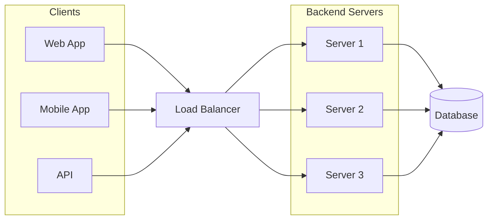
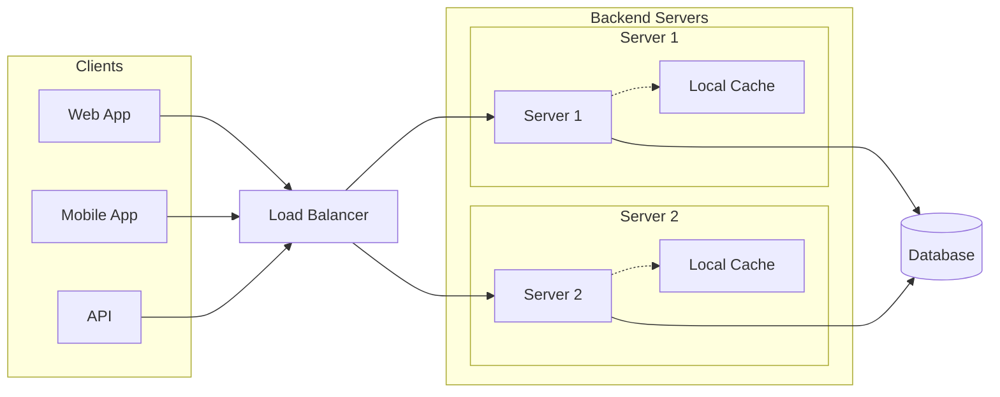
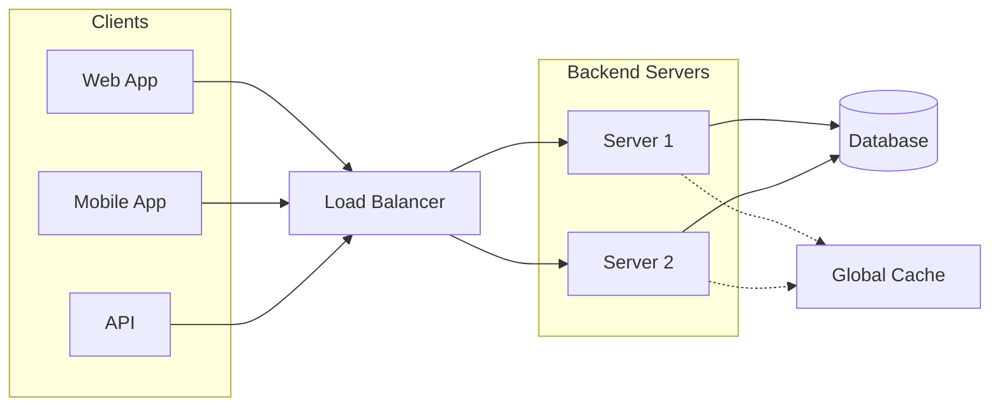

# Scaling with Redis - Eviction policies and cluster mode

> Setting up Redis cluster, LRU with limited space, show how eviction happens as you push keys. Simple get, set operations. For more operations, we can redirect to https://try.redis.io/ in the video.

## Script

- [x] `Motivation` - Why do we need Redis?
  - [x] `Alternatives` - What are some other solutions to the problems presented?
- [x] `Redis`
  - [x] What is Redis?
  - [x] How does Redis work?
  - [x] Installation
- [x] `Basic Redis commands`
  - [x] `SET`
  - [x] `GET`
  - [x] `DEL`
  - [x] `INCR`
  - [x] `EXISTS`
  - [x] `CONFIG`
- [x] `Eviction policies`
  - [x] `Background` - What is an eviction policy?
  - [x] `Setup` - Using Redis with limited space
  - [x] `No eviction` - What happens when the memory limit is reached?
  - [x] `LRU` - Least Recently Used eviction policy
  - [x] Other eviction policies
- [x] `Cluster mode`
  - [x] `Background` - What is cluster mode?
  - [x] `Setup` - Setting up Redis cluster
  - [x] `Operations` - Simple get, set operations
  - [ ] ~~~Integrating clusters with python~~~ Removed due to content overflowing

## Table of contents

- [Scaling with Redis - Eviction policies and cluster mode](#scaling-with-redis---eviction-policies-and-cluster-mode)
  - [Script](#script)
  - [Table of contents](#table-of-contents)
  - [Motivation](#motivation)
    - [Local cache](#local-cache)
    - [Global cache](#global-cache)
    - [Distributed cache](#distributed-cache)
  - [Redis](#redis)
    - [Usage](#usage)
      - [Setup](#setup)
      - [Commands](#commands)
      - [Keys](#keys)
  - [Eviction policies](#eviction-policies)
    - [LRU](#lru)
  - [Cluster mode](#cluster-mode)
    - [Motivation](#motivation-1)
    - [Specification](#specification)
      - [Sharding](#sharding)
      - [Replication](#replication)
      - [Configuration](#configuration)
    - [Setup](#setup-1)
    - [Testing the cluster](#testing-the-cluster)
  - [Code Glossary](#code-glossary)
  - [References](#references)

## Motivation

The new year is just around the corner which means it is time for some shopping and crazy sales. You are a developer at a popular e-commerce website `Nile.com`. Currently, you have a very simple setup where you have few servers behind a load balancer and a database server.



As the number of users increase, you start to see some performance issues. The database server is getting overloaded, and the application servers are not able to handle the load. The average response time for the APIs is increasing and is well above the acceptable threshold of 200ms.

You decide to do some digging and find out that the database is getting overloaded because of the number of queries being made. You see that there are a lot of duplicate queries being made. This is a prime candidate for caching.

### Local cache

You decide to add a local cache to the application servers which will store the results of the popular queries. This will reduce the number of queries being made to the database. The data can be stored in memory, which is fast, but the memory is limited. You can also store the data on disk, which is slower, but has more space. However, the access time in each case is still faster than the database due to network latency.



Now the application servers are able to handle the load and the response time is well within the acceptable threshold. However, you are still seeing some performance issues.

- `Cache misses` - You still notice that there are a lot of cache misses. This is because the requests are being distributed across the application servers. This means that the local cache on each server will only have a subset of the data.
- `Stale data` - The data in the local cache is not always up to date. Again this is because the requests are being distributed across the application servers and updates to the data are not being propagated to each local cache.
- `Memory consumption` - The local cache is consuming a lot of memory.
  Your application servers are coupled with the local cache. This means that you cannot scale the application servers independently of the local cache or vice versa.

### Global cache

Due to the above issues, it becomes apparent that you need to move the local cache to a separate server. This will allow you to scale the application servers and the cache servers independently. This will also allow you to have a single source of truth for the data.

This is where a global cache comes in. The global cache is a separate server which stores the data. The application servers can query the database and the global cache to get the data. The global cache can also be updated by the application servers. This will allow the application servers to have a single source of truth for the data.



### Distributed cache

There still exists some scope of further improvement:

- `Single point of failure` - The global cache is a single point of failure. If the global cache goes down, the application servers might not be able to get the data.
- `Scalability` - The global cache is a single server. This means that it can only handle a certain amount of traffic. If the traffic increases, the global cache will not be able to handle it. Horizontal scaling wold require massive changes while vertical scaling might not be financially viable.

This is where a distributed cache comes in. The distributed cache is a cluster of servers which store the data.

However, the distributed cache is not a drop in replacement for the global cache. The distributed cache is a cluster of servers which store the data. Rather than implementing a distributed cache from scratch, you can use a third party solution like Redis, Memcached, etc.

## Redis

* Redis is an **in-memory** key-value data store that can be used as a database, cache, and message broker.
It shares the benefits of a local cache like **fast access** and **low latency** due to the data being stored in memory.

* `Optional durability` - Using volatile memory means that the data is lost when the server is restarted. However, Redis provides the option to persist the data to disk. This means that the data can be recovered even after a server restart.

### Usage


!!! info "Redis is a key-value store"

    Redis is a key-value store. This means that the data is stored as a key-value pair. The key is used to retrieve the value. The key can be any string. The value can be a string, a list, a set, a sorted set, a hash, or a bitmap.

    ```redis
    SET key value
    GET key
    ```

    ```redis
    SET user:1 "Tantia Tope"
    GET user:1
    ```


#### Setup
* `Install` - `brew install redis`
  * Find other installation options [here]([here](https://redis.io/topics/quickstart)).
* `Start server` - `redis-server`
* `Start client` - `redis-cli`

#### Commands

* `SET` - `SET key value`
  * Set the value of a key.
  
    ```redis
    SET user:1 "Tantia Tope"
    ```
* `GET` - `GET key`
  * Get the value of a key.
  
    ```redis
    GET user:1
    > "Tantia Tope"
    ```
* `EXISTS` - `EXISTS key`
  * Check if a key exists.
  
    ```redis
    EXISTS user:1
    > 1  // 1 means true
    ```
* `DEL` - `DEL key`
    * Delete a key.
    
        ```redis
        DEL user:1
        > 1  // 1 means true
        ```
* `INCR` - `INCR key`
    * Atomically increment the value of a key by 1.
    
        ```redis
        INCR counter
        > 1
        ```
* `CONFIG` - `CONFIG SET parameter value`
    * Set a configuration parameter to the given value.
    
        ```redis
        CONFIG SET maxmemory 1mb
        > OK
        ```
    
Try out the commands [here](https://try.redis.io/).

#### Keys

> * Very long keys are not a good idea. For instance a key of 1024 bytes is a bad idea not only memory-wise, but also because the lookup of the key in the dataset may require several costly key-comparisons. Even when the task at hand is to match the existence of a large value, hashing it (for example with SHA1) is a better idea, especially from the perspective of memory and bandwidth.
> * Very short keys are often not a good idea. There is little point in writing "u1000flw" as a key if you can instead write "user:1000:followers". The latter is more readable and the added space is minor compared to the space used by the key object itself and the value object. While short keys will obviously consume a bit less memory, your job is to find the right balance.
> * Try to stick with a schema. For instance "object-type:id" is a good idea, as in "user:1000". Dots or dashes are often used for multi-word fields, as in "comment:4321:reply.to" or "comment:4321:reply-to".
> * The maximum allowed key size is 512 MB.


## Eviction policies

Redis stores the data in memory, that is a limited resource. For applications running on high user base production environment, redis can run out of memory. This is where eviction policies come in. Eviction policies are used to determine which data to evict when the memory limit is reached.

By default, Redis uses the `noeviction` policy. This means that when the memory limit is reached, Redis will not evict any data. Instead, it will return an error.

```redis
127.0.0.1:6379> CONFIG GET maxmemory-policy
1) "maxmemory-policy"
2) "noeviction"
```
How? As we have asked redis server to not restrict its memory use, and a noeviction policy means the data in redis would keep on growing, at some point, it reaches a critical level. 

Redis can no longer add new records to it, as it gets limited by the memory available. The system kills redis as it gets choked by lack of memory and our apps begin to crash due to connection refused from redis. 

Since redis is an in-memory solution, we have to increase the system’s RAM, and restart it to get it running again. Even though increasing RAM is a possible solution technically, this often is not a viable solution financially as RAM can cost a dime when we start scaling vertically. So then, there are disk based data store options which one can explore in these cases.

A cache store as the name suggests, is a solution for short-lived data which is safe to be purged in due course of time. Cache is used in applications that require high speed access to certain set of data on a regular basis. Cache is also used when an application want to store intermediate metadata of ongoing tasks for some hours or even days. This suggests that we can ask redis to remove unwanted or outdated records from its memory that would reduce the memory footprint of redis and reduce the chance of a downtime.

Redis provides a number of eviction policies to choose from. The eviction policy can be set using the `maxmemory-policy` configuration parameter.

### LRU

The `LRU` policy evicts the least recently used keys first.

```redis
127.0.0.1:6379> CONFIG SET maxmemory-policy allkeys-lru
OK
```

Let us also set the `maxmemory` to 1MB.

```redis
127.0.0.1:6379> CONFIG SET maxmemory 1mb
OK
```

To test the LRU policy, the redis-cli's capabilities are limited. Hence, we will switch to a python script using the [redis-py](https://github.com/redis/redis-py) library.

Let us first create an instance of the redis client.

```python
from redis import Redis

instance = Redis(host=DEFAULT_HOST, port=DEFAULT_PORT)
```

Flush the database to remove any existing data.

```python
instance.flushall()
```
Let's test out creating a key-value pair.

```python
instance.set('key', 'value')
```

Getting the value of the key.

```python
instance.get('key')
```
```
> b'value'
```

Let us check the memory usage of the redis instance.

```python
print(f"Used memory: {node.info()['used_memory_human']}")
```
```
> Used memory: 1.49M
```

To simulate the LRU policy, we will be a little creative. We will create some key-value pairs first and then access a subset of them. Then, we will flood the redis instance with a lot of key-value pairs. This will cause the redis instance to reach the memory limit and start evicting keys.

According to the LRU policy, the least recently used keys will be evicted first. Hence, the keys that we accessed earlier will not be evicted.

Let us first create a utility function to create a key-value pair and access it.

```python
def save_data(end: int, start: int = 0) -> None:
    for i in range(start, end):
        instance.set(f"key-{i}", 
                      f"value-{i}")

def read_data(end: int, start: int = 0) -> None:
    for i in range(start, end):
        instance.get(f"key-{i}")
```
Let us create the initial key-value pairs.

```python
store_data(redis, end=5000)
```

Read a subset of the keys.

```python
read_data(redis, end=1000)
```

Now, let us flood the redis instance with a lot of key-value pairs.

```python
store_data(redis, end=10000, start=5000)
```

Let us see if the keys that we accessed earlier are still present.

```python
instance.get('key-1')
```
```
> b'value-1'
```

```python
instance.get('key-1000')
```
```
> b'value-1000'
```

You could also use the `mget` command to get multiple keys at once.

```python
instance.mget([f"key-{i}" for i in range(1, 1001)])
```

Plotting the distribution of the keys that were evicted affirms the LRU policy.


It can be noticed here that:
* There are lesser evictions for the keys that were accessed earlier.
* The remaining keys in the initial suffered a lot of evictions.
* The keys in the second set are evicted in the order they were created and hence most recent keys are retained.

Find out more about other eviction policies [here](https://redis.io/docs/reference/eviction/).

## Cluster mode


### Motivation
Currently, we have been working with a single redis instance. This is fine for development and testing purposes. However, for production, we need a more robust solution. Redis provides a cluster mode to achieve this.

As mentioned in the above sections, a distributed cache is preferred over a single instance cache. This is because a single instance cache is a single point of failure. If the cache goes down, the entire application will be affected. A distributed cache is a collection of cache instances. If one cache instance goes down, the other instances can still serve the requests.

Also, a single instance cache is limited by the memory available on the machine. A distributed cache can be scaled horizontally by adding more cache instances. This will increase the memory available to the cache.

### Specification

Each cluster node is a single Redis instance. The cluster nodes are connected to each other using a `gossip protocol`. This allows the cluster to automatically detect the failure of a node and reconfigure itself to ensure that the data is still available. Hence, ever cluster node requires two open TCP ports: a Redis TCP port used to serve clients, e.g., 6379, and second port known as the cluster bus port used to communicate with other nodes, e.g., 16379.

#### Sharding 
In cluster mode, Redis automatically partitions the data across multiple nodes. A way to shard the data uniformly is to use the consistent hashing algorithm. This algorithm maps a key to a node in the cluster. The hash of the key is used to determine the node. This ensures that the same key is always mapped to the same node. This is important as it ensures that the data is always available on the same node. This also ensures that the data is evenly distributed across the nodes.

However, this algorithm has a problem. If a node is added or removed from the cluster, the data will be redistributed across the nodes. This will cause a lot of data movement and will affect the performance of the cluster. Hence, **Redis does not use the consistent hashing algorithm.**

To solve the problem, Redis uses a concept called `slot`. A slot is a range of keys. Each node is responsible for a subset of the slots. The number of slots is fixed at 16384. This means that each node is responsible for 16384/number of nodes keys. This ensures that the data is evenly distributed across the nodes. If a node is added or removed from the cluster, the data is redistributed across the nodes. However, this redistribution is limited to the slots that the node is responsible for. This ensures that the data movement is limited and the performance of the cluster is not affected.

Learn more about the sharding algorithm [here](https://severalnines.com/blog/hash-slot-vs-consistent-hashing-redis/).

#### Replication
Since the data is partitioned across multiple nodes, it is important to ensure that the data is replicated across the nodes. This ensures that the data is available even if a node goes down. Redis uses a master-slave replication model. The master node is responsible for the data. The slave nodes are responsible for replicating the data from the master node. If the master node goes down, one of the slave nodes is promoted to be the new master node. This ensures that the data is still available.

#### Configuration

The cluster mode is enabled by setting the `cluster-enabled` configuration option to `yes`. The default value is `no`.

To enable cluster mode, set the `cluster-enabled` directive to yes. Every instance also contains the path of a file where the configuration for this node is stored, which by default is `nodes.conf`. This file is never touched by humans; it is simply generated at startup by the Redis Cluster instances, and updated every time it is needed.

Note that the minimal cluster that works as expected must contain at least three master nodes.

This what our `redis.conf` file looks like.

```bash
port 6379
cluster-enabled yes
cluster-config-file nodes.conf
cluster-node-timeout 5000
appendonly yes
```

### Setup

To setup a cluster, we will use docker. We will create a docker network to connect the redis instances. This will allow the redis instances to communicate with each other.

```bash
> docker network create redis-cluster
```

Check if the network was created.

```bash
> docker network ls
NETWORK ID     NAME              DRIVER    SCOPE
a80462bf2a69   redis_cluster     bridge    local
```

Now, we will create the redis instances. We will create 6 redis instances. 3 of them will be master nodes and the other 3 will be slave nodes.

You can create the instances using the following command.
```bash
> docker run -d -v \
  redis.conf:/usr/local/etc/redis/redis.conf \
  --name redis-<node-number> --net redis-cluster \
  redis redis-server /usr/local/etc/redis/redis.conf
```

The above command will create a redis instance with the name `redis-<node-number>`. The configuration file is mounted to the container. The container is connected to the `redis-cluster` network.

You can either create the instances manually or write a small bash script to create the instances.

```bash
#!/usr/bin/env bash
for ind in $(seq 1 6); do
    docker run -d \
        -v redis.conf:/usr/local/etc/redis/redis.conf \
        --name redis-$ind \
        --net redis_cluster \
        redis redis-server /usr/local/etc/redis/redis.conf
done
```

This will create 6 redis instances and connect them to the `redis-cluster` network.

Check if the instances were created.

```bash
> docker ps
```

You can use the inspect command to get the IP address of the instances.

```bash
> docker inspect -f '{{ (index .NetworkSettings.Networks "redis_cluster").IPAddress }}' redis-1
172.19.0.2
```

Currently, Redis Cluster does not support NATted environments and in general environments where IP addresses or TCP ports are remapped. Along with this, to run a Redis cluster using containers, we need a script distributed by Redis

```bash
docker run -i --rm --net redis_cluster ruby sh -c '\
 gem install redis \
 && wget http://download.redis.io/redis-stable/src/redis-trib.rb \
 && ruby redis-trib.rb create --replicas 1 \
 <ip-address-1>:6379 <ip-address-2>:6379 \
 ...
```

or you can use the `redis-cli` command as well
```bash
> redis-cli --cluster create  <ip-address-1>:6379 \
 ...
--cluster-replicas 1
```


Using the replicas option, we can specify the number of replicas for each master node. In our case, we have specified 1 replica for each master node and hence, we have 3 master nodes and 3 slave nodes.

It is just better to combine these steps in a bash script.

```bash
#!/usr/bin/env bash
for ind in $(seq 1 6); do
    docker run -d \
        -v redis.conf:/usr/local/etc/redis/redis.conf \
        --name redis-$ind \
        --net redis_cluster \
        redis redis-server /usr/local/etc/redis/redis.conf
done

echo 'yes' | docker run -i --rm --net redis_cluster ruby sh -c '\
 gem install redis \
 && curl -O http://download.redis.io/redis-stable/src/redis-trib.rb \
 && ruby redis-trib.rb create --replicas 1 \
 '"$(for ind in $(seq 1 3); do
    echo -n "$(docker inspect -f \
        '{{(index .NetworkSettings.Networks "redis_cluster").IPAddress}}' \
        "redis-$ind")"':6379 '
done)"
```

Your cluster is now ready. You can check the status of the cluster using the `cluster info` command.

```bash
> docker exec -it redis-1 redis-cli -c cluster info
```

### Testing the cluster

To connect to the cluster, use the following command to connect to the container.

```bash
> docker exec -it redis-1 bash
root@f7d86a9667e8:/data# redis-cli
127.0.0.1:6379>
```

Set a key-value pair.

```redis
redis 127.0.0.1:6379> set foo bar
-> Redirected to slot [12182] located at 172.19.0.2:6379
OK
```

The Redis Cluster client will automatically redirect the request to the correct node. You can check the node to which the request was redirected using the `cluster nodes` command.

```redis
> cluster nodes
```
The above command will show the node to which the request was redirected.

You can also use the `cluster slots` command to get the slot to node mapping.

```redis
> cluster slots
```

Adding another key-value pair could result in a different node being redirected to.

```redis
redis 127.0.0.1:7002> set hello world
-> Redirected to slot [866] located at 172.19.0.4:6379
OK
```

Fetching the value of the key will also result in a redirection to the correct node where the key is stored.

```redis
redis 127.0.0.1:7000> get foo
-> Redirected to slot [12182] located at 172.19.0.2:6379
"bar"
redis 127.0.0.1:7002> get hello
-> Redirected to slot [866] located at 172.19.0.4:6379
"world"
```

## Code Glossary

| Description         | Link                                                                                                     |
| ------------------- | -------------------------------------------------------------------------------------------------------- |
| `redis.conf`        | [1](https://github.com/kanmaytacker/system-design/blob/master/guides/redis/redis.conf)                   |
| `create_cluster.sh` | [2](https://github.com/kanmaytacker/system-design/blob/master/guides/redis/create_cluster.sh)            |
| `Python client`     | [3](https://github.com/kanmaytacker/system-design/blob/master/guides/redis/python/redis-cluster.py#L178) |


## References
- [Eviction Policies](https://redis.io/docs/reference/eviction/)
- [How Redis eviction policies work](https://crypt.codemancers.com/posts/2021-05-21-understanding-how-redis-eviction-policies-work/)
- [Redis Cluster](https://redis.io/topics/cluster-tutorial)
- [Redis Cluster Specification](https://redis.io/topics/cluster-spec)
- [Creating a Redis Cluster using Docker](https://medium.com/commencis/creating-redis-cluster-using-docker-67f65545796d)
- [Building Redis cluster with Docker compose](https://pierreabreu.medium.com/building-redis-cluster-with-docker-compose-9569ddb6414a)