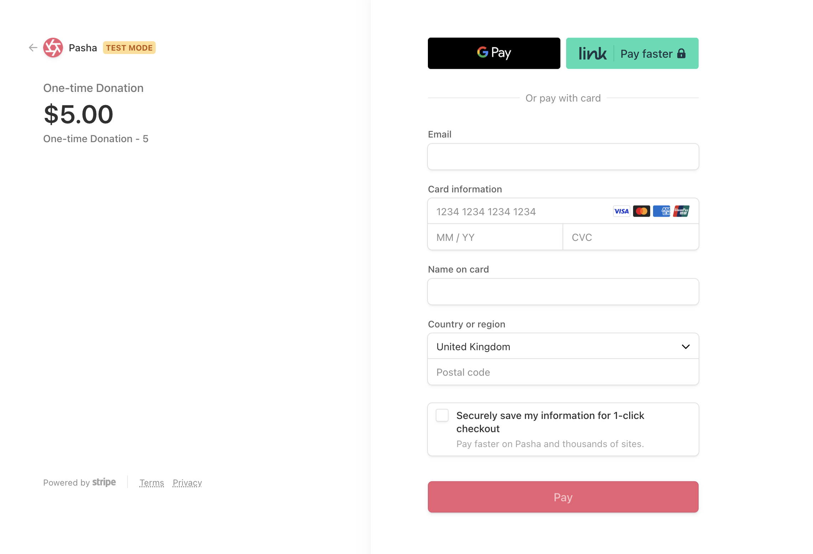
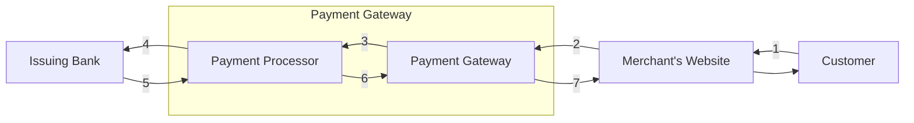
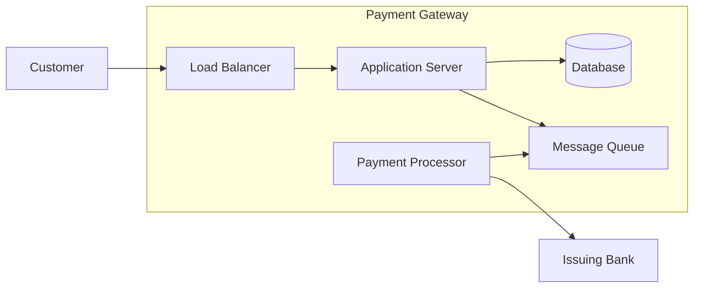
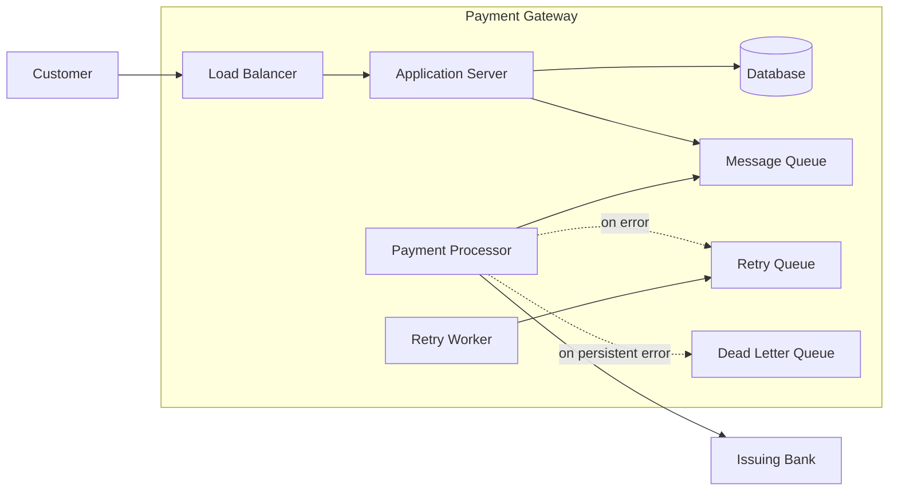

# Design a Payment Gateway
- [Design a Payment Gateway](#design-a-payment-gateway)
  - [Key Terms](#key-terms)
    - [Payment Gateway](#payment-gateway)
    - [Payment Processor](#payment-processor)
    - [Payment Service Provider (PSP)](#payment-service-provider-psp)
    - [Issuing Bank](#issuing-bank)
    - [Acquiring Bank](#acquiring-bank)
    - [Card Association](#card-association)
    - [PCI DSS](#pci-dss)
    - [3-D Secure](#3-d-secure)
    - [ISO 8583](#iso-8583)
  - [Overview](#overview)
    - [Requirements](#requirements)
      - [Functional Requirements](#functional-requirements)
      - [Non-functional Requirements](#non-functional-requirements)
    - [Back of the Envelope Estimation](#back-of-the-envelope-estimation)
  - [Design](#design)
    - [API Design](#api-design)
      - [Card Details](#card-details)
      - [Payment APIs](#payment-apis)
    - [Schema Design](#schema-design)
      - [Card tokenization](#card-tokenization)
      - [Transaction table](#transaction-table)
      - [Ledger table](#ledger-table)
  - [High Level Architecture](#high-level-architecture)
    - [Failures](#failures)
    - [Idempotency](#idempotency)
  - [References](#references)

## Key Terms

### Payment Gateway

A payment gateway is a service that authorizes credit card payments for e-commerce websites. It is the equivalent of a physical point-of-sale terminal located in many brick-and-mortar stores.

### Payment Processor

A payment processor is a company that facilitates credit card payments. Payment processors are distinct from payment gateways, but often provide both services to merchants. Payment processors typically charge higher fees than payment gateways.

### Payment Service Provider (PSP)

The service that ensures the payment is processed and the funds are transferred from the customer's credit card to the merchant's bank account. PSPs include payment gateways and payment processors.

### Issuing Bank

The bank that issued the customer's credit card.

### Acquiring Bank

The bank that will receive the funds from the customer's credit card payment.

### Card Association

A card association is an organization that manages the rules and regulations for a payment network. Examples of card associations include Visa, Mastercard, American Express, and Discover.

### PCI DSS

The Payment Card Industry Data Security Standard (PCI DSS) is a set of requirements designed to ensure that all companies that accept, process, store, or transmit credit card information maintain a secure environment.

### 3-D Secure

3-D Secure is a protocol that allows customers to authenticate themselves when making a payment. It is also known as "Verified by Visa" and "Mastercard SecureCode".

### ISO 8583

ISO 8583 is an international standard for financial transaction card originated interchange messaging. It is the primary messaging standard used by payment gateways.

---

## Overview

A payment gateway like Stripe or Razorpay allows merchants such as e-commerce websites to accept payments from customers without the hassle of integrating with multiple payment processors. Payment gateways are a critical component of any e-commerce website.

A sample flow of a payment gateway is as follows:
1. The customer enters their credit card details on the merchant's website.
2. The merchant's website sends the credit card details to the payment gateway.
3. The payment gateway transforms the details into a format that is compatible with the payment processor and sends it to the payment processor.
4. The payment processor sends the details to the issuing bank. This can be done using the card association's network or directly.
5. The issuing bank verifies the details and sends a response to the payment processor.
6. The payment processor sends a response to the payment gateway.
7. The payment gateway sends a response to the merchant's website.

The above flow is a simplified version of the actual flow. The actual flow comprises an authorization and a settlement. The authorization is the process of verifying the credit card details. The settlement is the process of transferring the funds from the customer's credit card to the merchant's bank account.

Also, the payment gateway will send the credit card details to the payment processor using the ISO 8583 standard. The payment processor will then send the details to the issuing bank using the card association's network.

### Requirements

#### Functional Requirements

- `Pay-in flow` - The payment gateway should allow customers to pay for goods and services.
- `Pay-out flow` - The payment gateway should allow merchants to receive payments from customers.
- `Store card details` - The payment gateway should allow customers to store their credit card details for future payments.

#### Non-functional Requirements

- `Reliability and fault tolerance` - Payment gateways are critical components of e-commerce websites. If there are any failures, they should be handled gracefully and seamless for the customer.
- `Reconciliation` - The payment gateway should be able to reconcile the payments made by customers with the payments received by merchants.
- `Idempotency` - The payment gateway should be able to handle duplicate requests from the merchant's website. The payment should be processed exactly once.
- `Security` - Payment gateways handle sensitive customer data such as credit card details. They should be secure and foolproof against attacks.

**CAP Theorem**

> Given a distributed computer system, it is impossible to simultaneously provide availability and consistency.

This adds the last non-functional requirement of `Consistency` to the list.

---

### Back of the Envelope Estimation

Let us assume that the system needs to process 1 million transactions per day. This makes the transactions per second (TPS) ~10. We have to build a CP system that can handle 10 TPS. This is not a very high TPS and relational databases can handle this easily.

Along with TPS, we also consider the data size. However, the amount of data generated by a payment gateway is not very high. The credit card details are encrypted and stored in the database. The only data that is not encrypted is the transaction ID. This is a 64-bit integer. This makes the data size per transaction ~8 bytes. This makes the total data size per day ~8 GB.

---

## Design

### API Design

The interaction between the merchant's website and the payment gateway will be through REST APIs. 

#### Card Details

We would need a set of CRUD APIs to manage the card details of the customers. The major APIs are as follows:
- `POST /card` - Create a new card. This API will be used when the customer enters their credit card details for the first time. The request body will contain the credit card details such as the card number, expiry date, and CVV. If you have the customer ID, a better endpoint would be `POST /customer/{customer_id}/card`.
- `GET /card/{card_id}` - Get the details of a card. This API will be used when the customer wants to view their card details.

#### Payment APIs

We would need a set of APIs to process payments. The major APIs are as follows:
- `POST /payment` - Create a new payment. This API will be used when the customer wants to pay for goods and services. The request body will contain the card ID, amount, and currency.
- `GET /payment/{payment_id}` - Get the details of a payment. This API will be used when the merchant wants to view the details of a payment.
---

### Schema Design

The two major requirements are to store the transaction details and the balance of a merchant.

You might think of storing the card details as well. However, the card details are sensitive data and should not be stored in the database. In fact, an application can only store the card details if it is PCI DSS compliant. This is also where tokenization comes into play. We will store the tokenized card details in the database. 

#### Card tokenization
Tokenization is the process of replacing sensitive data with a unique identifier. This makes the data non-sensitive and allows it to be stored in the database. The tokenized data can be used to retrieve the sensitive data from the payment processor. The process is as follows:
1. The customer enters their credit card details on the payment gateway.
2. The payment gateway sends the credit card details to the card association's network.
3. The card association creates a token and sends it to the payment gateway.
4. The payment gateway stores the token in the database.

#### Transaction table

The transaction table will store the details of all the transactions. The schema is as follows:
| id | user_id | card_id | amount | currency | status | created_at | updated_at |
| --- | --- | --- | --- | --- | --- | --- | --- |

The above schema works for the pay-in flow. For the pay-out flow, we will need to identify the total amount paid to the merchant. This can be done by adding a `merchant_id` column to the above schema. However, identifying the total amount owed will also require figuring out if the transaction is a credit or a debit. This can be done by adding a `type` column to the above schema. The `type` column can have the values `credit` or `debit`.

The above approach works but for reconciliation, we will have to query the database multiple times. Instead, we can used a technique called `double-entry bookkeeping`. This is a technique used by accountants to keep track of the transactions.

#### Ledger table

Double entry bookkeeping is a technique used by accountants to keep track of the transactions. The ledger table will store the user along with the columns for the debit and credit amounts. The schema is as follows:
| id | user_id | debit | credit |
| --- | --- | --- | --- |

If a system is consistent, the sum of the debit and credit amounts should be equal. This makes the ledger table a good candidate for reconciliation.

---

## High Level Architecture

The high level flow and architecture of the payment gateway is as follows:

1. The customer clicks on the `Pay` button on the merchant's website.
2. The request goes to the load balancer of the payment gateway.
3. The load balancer routes the request to the payment gateway application server.
4. The payment gateway generates a unique transaction ID and stores the transaction details in the database.
5. The payment gateway pushes the transaction details to the message queue.
6. The payment processor consumes the message from the message queue and calls the issuing bank.
7. If the transaction is successful, the payment gateway updates the transaction details in the database and sends a response to the merchant's website.
8. The merchant's website redirects the customer to the success page.

### Failures

Payment gateways are critical components of e-commerce websites. If there are any failures, they should be handled gracefully and should seem seamless for the customer. 

To handle failures, we can use the following techniques:
- `Retry Queue` - On an error, the payment processor can push the transaction details to a retry queue.
The payment processor can then retry the transaction after a certain interval. If it fails again, the worker can use an exponential backoff algorithm to retry the transaction.
- `Dead Letter Queue` - If the transaction fails after a certain number of retries, the payment processor can push the transaction details to a dead letter queue. The dead letter queue can be used to manually process the transaction.

### Idempotency

One of the major requirements of a payment gateway is idempotency. Idempotency is the property of an operation that can be applied multiple times without changing the result. This is important because the payment gateway will receive multiple requests for the same transaction. The payment gateway should be able to handle these requests gracefully.

The payment gateway should not charge the customer multiple times for the same transaction. The payment gateway should also not send multiple requests to the issuing bank for the same transaction.

To handle idempotency, we use a unique transaction ID. The payment gateway will generate a unique transaction ID for each transaction and pass it to the merchant's website. The merchant's website will then pass the transaction ID to the payment gateway. If the payment gateway receives a request with a transaction ID that already exists in the database, it will return the transaction details from the database.

---

## References

- [Stripe API](https://stripe.com/docs/api/charges/create)
- [Designing a Payment Gateway](https://www.youtube.com/watch?v=NxjGFIgFCbg)
- [Payment Gateway - All you need to know](https://www.youtube.com/watch?v=yt3My3vUBXo)
- [Card tokenization](https://www.geeksforgeeks.org/what-is-card-tokenization-and-its-benefits/)

