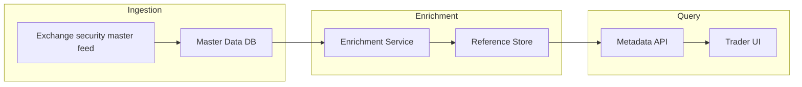
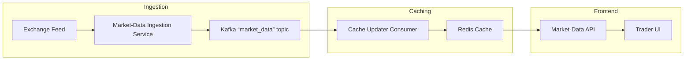
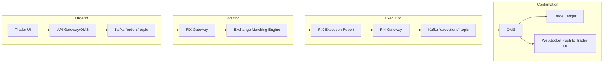

# System Design of a Real-time Stock Market Trading Platform


## How to approach design problems?

System design is a very broad topic. There are many ways to approach a design problem and there is no one right answer. It is important to understand the requirements and constraints of the problem. It is also important to understand the trade-offs between different approaches. Thus, a systematic approach is required to solve a design problem.

The following is a general approach to solve a design problem:

1. `Gather requirements` – Understand the problem and the requirements.  
2. `Clarity` – Ask questions to clarify the requirements.  
3. `Scope the problem` – Identify and separate the important requirements from the minor ones. Identify non-functional requirements and do some back-of-the-envelope calculations to get an idea of the scale of the problem.  
4. `Design` – Create a technical design document that describes the architecture and the components of the system.

## What is a Stock Market Trading Platform?

> A stock market trading platform is a software system that enables the buying and selling of financial instruments (stocks, bonds, derivatives) in real-time. It connects various market participants including retail investors, institutional investors, brokers, and exchanges to facilitate trading activities.

Think of it like a massive digital marketplace – imagine a farmer’s market where instead of vegetables, people are trading pieces of companies. The trading platform is like the market square where buyers and sellers meet, but with millions of transactions happening every second.

The Indian stock market ecosystem consists of:
- **Exchanges**: BSE (Bombay Stock Exchange) and NSE (National Stock Exchange)  
- **Brokers**: Intermediaries who execute trades on behalf of clients  
- **Depositories**: CDSL and NSDL for holding securities in electronic form  
- **Clearing Corporations**: For settlement of trades  
- **Regulators**: SEBI (Securities and Exchange Board of India)

---

## Requirement 1: List All Tradable Equities

### User Story  
> As a trader I want to see the list of all tradable equities (symbol, name, series, plus enriched metadata) so I can pick one.

### Columns & Avg. Size

| Column        | Type           | Avg. length (chars) | Bytes/row |
|---------------|----------------|---------------------|-----------|
| **SYMBOL**    | CHAR(10)       | 6                   | 10        |
| **NAME**      | VARCHAR(100)   | 50                  | 50        |
| **SERIES**    | CHAR(4)        | 2                   | 4         |
| **DESCRIPTION** | VARCHAR(255) | 100                 | 100       |
| **LOGO_URL**  | VARCHAR(200)   | 100                 | 100       |
| **SECTOR**    | VARCHAR(50)    | 20                  | 20        |
| **INDUSTRY**  | VARCHAR(50)    | 20                  | 20        |
| **Total**     | –              | –                   | **304 B** |

- **Storage footprint**  
  - 2 000 rows × 304 B ≈ **608 000 B** (~594 KB)  
  - +30% overhead (indexes, row headers) → ≈ **790 KB**  

### BoE Calculations  
- Trivial to load 594 KB into memory for sub-millisecond queries.  
- Even with millions of users, the per-request data is <1 MB.

### Data‐Flow



## Requirement 2: Drill down on a stock

### User Story  
> As a trader I click on a stock symbol and immediately see its Last Traded Price (LTP), top-of-book bid/ask and traded volume.

### Market-Data Levels  
- **Level 1**: Top-of-book only – best bid/ask, last trade price, total volume.  
  _What we need today._  
- **Level 2**: Depth of book – multiple bid/ask levels (e.g. top 5).  
- **Level 3**: Full order-book events – every add, modify, cancel.  

### Data Source & Format  
- **Source**:  
  - NSE MDP multicast feed or BSE TCP feed  
  - Vendor APIs (PROTOBUF/JSON over TCP/WebSocket)  
- **Schema** (JSON example):  
  ```json
  {
    "symbol": "TCS",
    "timestamp": 1625087400123,
    "last_price": 3120.50,
    "bid_price": 3119.00,
    "bid_qty": 100,
    "ask_price": 3121.00,
    "ask_qty": 50,
    "volume": 1500
  }
  ```

### What is an Order Book?  
An **order book** is the central data structure in a trading system that records all outstanding buy and sell orders for each symbol. It’s effectively two lists:

- **Bid side**: Buy orders, sorted by price descending (highest bid first).  
- **Ask side**: Sell orders, sorted by price ascending (lowest ask first).

Within each price level, orders queue in **time-priority** (FIFO).

### Internal Structure  
A typical in-memory representation uses two sorted maps or priority queues:

```
bids: Map< price ↓ , Queue<order> >
asks: Map< price ↑ , Queue<order> >

Each order record contains:

{ orderId, symbol, side (BUY/SELL), price, quantity, timestamp }
```

#### Matching Logic

1. **Incoming Order**

   * **Market order**: match immediately against best opposite side until filled or book exhausted.
   * **Limit order**: match if `buy.price ≥ best ask.price` (for a buy) or `sell.price ≤ best bid.price` (for a sell).
   * Unfilled remainder becomes a rest­ing order in the book.

2. **Price-Time Priority**

   * Always match at the best price first.
   * At same price, older orders fill before newer ones.

3. **Trade Reports**

   * Each match generates a **trade event** (price, quantity, buyerOrderId, sellerOrderId).

### Example Scenarios

#### 1. Only Sellers In Book

Initial book for symbol XYZ:

```plaintext
Asks:
  101.00 × 100
  102.00 × 200
Bids:
  — (empty)
```

* **Incoming**: Buy limit 50 @ 100

  * 100 > best ask (101)? No → **no match**, add bid 100 × 50
* **Incoming**: Buy limit 150 @ 101

  * 101 ≥ best ask (101)? Yes → match 100 @ 101
  * Remainder 50 @ 101; next ask is 102 (101 < 102) → leftover 50 enters bid

Resulting book:

```plaintext
Asks:
  102.00 × 200
Bids:
  101.00 × 50
  100.00 × 50
```

#### 2. Only Buyers In Book

Initial book for symbol XYZ:

```plaintext
Bids:
  99.00 × 100
  98.00 × 200
Asks:
  — (empty)
```

* **Incoming**: Sell limit 150 @ 100

  * 100 ≤ best bid (99)? No → **no match**, add ask 100 × 150
* **Incoming**: Sell limit 80 @ 98

  * 98 ≤ best bid (99)? Yes → match 80 @ 99

Resulting book:

```plaintext
Bids:
  99.00 × 20      (100 – 80 matched)
  98.00 × 200
Asks:
  100.00 × 150
```

#### 3. Market Order Partial Fill

Given book:

```plaintext
Asks:
  101.00 × 100
  102.00 × 200
Bids:
  99.00 × 150
```

* **Incoming**: Buy market 250

  * Fills 100 @ 101, then 150 @ 102 → **fully filled**, ask side now has 50 @ 102 left; no resting bid entry.

---


### Ingestion Pipeline

1. **Exchange feed** → **Ingestion Service**

   * Subscribes to NSE/BSE multicast or TCP, parses raw messages.
2. **Ingestion Service** → **Kafka**

   * Publishes normalized “market\_data” events into a Kafka topic (partitioned by symbol).
3. **Cache Updater** (Kafka consumer) → **Redis**

   * Reads from Kafka, writes the latest LTP, bid/ask, volume into Redis hashes for O(1) access.
4. **Market-Data API** → **Trader UI**

   * Serves cache reads over REST/gRPC.
   * Pushes real-time updates to the front-end via WebSocket subscriptions.

### Data‐Flow Diagram


---

## Requirement 3: View Historical Prices

### User Story  
> As a trader I want to view historical OHLC (open/high/low/close) bars (e.g. 1-minute) over days–months to analyse trends.

### BoE Calculations

| Metric                       | Calculation                       | Value        |
|------------------------------|-----------------------------------|--------------|
| Symbols                      | –                                 | 2 000        |
| Bars per symbol per day      | 60 min × 24 h                     | 1 440        |
| Total rows per day           | 2 000 × 1 440                     | 2 880 000    |
| Row size                     | 6 fields × 8 B each               | 48 bytes     |
| Daily storage                | 2 880 000 × 48 B                  | ~138 MB      |
| +30% overhead (indexes, etc) | 138 MB × 1.3                      | ~180 MB/day  |
| **Monthly (30 days)**        | 180 MB/day × 30                   | **5.4 GB**   |

### Storage Choice  
- **Time-Series DB** (e.g. TimescaleDB, InfluxDB)  
  - Columnar compression, downsampling, fast range scans.  
- **Why not RDBMS?**  
  - High write throughput (millions of rows/day).  
  - Complex partitioning/sharding, slower time-based queries.

### Data-Flow Diagram

```mermaid
flowchart LR
  subgraph Aggregation
    A[Kafka “ticks” topic] --> B[Bar Aggregator Service]
    B --> C[Kafka “bars” topic]
  end

  subgraph Storage
    C --> D[TSDB Writer]
  end

  subgraph Query
    D --> E[Historical-Data API]
    E --> F[Trader UI]
  end
````

---

## Requirement 4: Watchlist

### User Story

> As a trader I want to add/remove stocks to a personal watchlist for quick access.

### BoE Calculations

| Metric                | Calculation                        | Value          |
| --------------------- | ---------------------------------- | -------------- |
| Users                 | –                                  | 500 000        |
| Avg. symbols per user | –                                  | 10             |
| Total rows            | 500 000 × 10                       | 5 000 000      |
| Row size              | user\_id (16 B) + symbol\_id (4 B) | 20 bytes       |
| Base storage          | 5 000 000 × 20 B                   | 100 MB         |
| +30% overhead         | 100 MB × 1.3                       | \~130 MB total |

### Storage Choice

* **Relational DB** (`watchlist(user_id, symbol_id)`) for ACID and joins with metadata.
* **Redis Cache** (e.g. key=`watchlist:{user_id}` → list of symbols) for O(1) reads.

### Data-Flow Diagram

```mermaid
flowchart LR
  subgraph UserAction
    U[Trader UI] --> V[Watchlist API]
  end

  subgraph Storage
    V --> W[Postgres: watchlist table]
    V --> X[Redis Cache Updater]
  end

  subgraph Query
    U --> Y[Watchlist API]
  end

```

---

## Requirement 5: Place an Order

### User Story

> As a trader I submit a buy/sell order and receive acknowledgements and execution updates.

### Order Placement Flow

1. **Trader UI**

   * Sends order request (symbol, qty, price, type) via REST/gRPC + TLS.
2. **API Gateway / OMS**

   * Authenticates, validates, runs pre-trade risk checks.
   * Publishes to Kafka `orders` topic (partitioned by symbol).
3. **Order Router / FIX Gateway**

   * Consumes from Kafka, translates to FIX 4.4, maintains FIX sessions with NSE/BSE.
4. **Exchange Matching Engine**

   * Matches orders against the order book, emits trade fills.
5. **Execution Reports**

   * Exchange → FIX Gateway → Kafka `executions` topic.
6. **OMS & UI Update**

   * OMS consumes `executions`, writes to trade ledger (Cassandra/Postgres).
   * Pushes real-time notifications via WebSocket to Trader UI.

### Data-Flow Diagram


